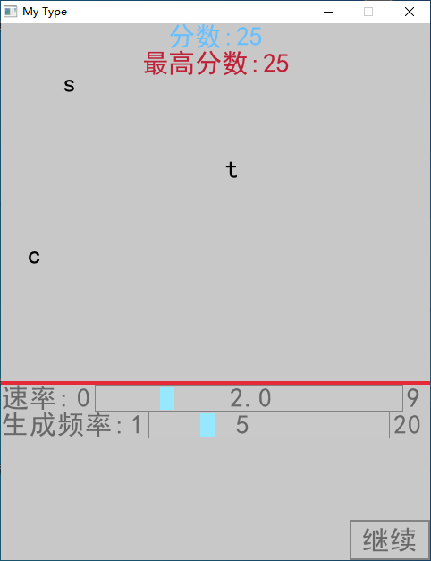

# 概况

这是一个简单的练习打字的软件。

# 项目结构

```bash
.
|-- CMakeLists.txt
|-- README.md
|-- include
|   `-- raylib
|       |-- raygui.h
|       |-- raylib.h
|       |-- raymath.h
|       `-- rlgl.h
|-- lib
|   `-- libraylib.a
|-- raygui.json
|-- screenshots
|   `-- MyType_v0.2.0.png
`-- src
    `-- main.cpp

```

# 说明

+ 本软件基于 Raylib 图形库。
+ 功能有待完善

# 待办事项

- [x] ~~添加滑块以控制字母下落频率~~

- [x] ~~添加滑块以控制字母下落速率~~

- [ ] 更美观的 GUI 界面

# 截图


